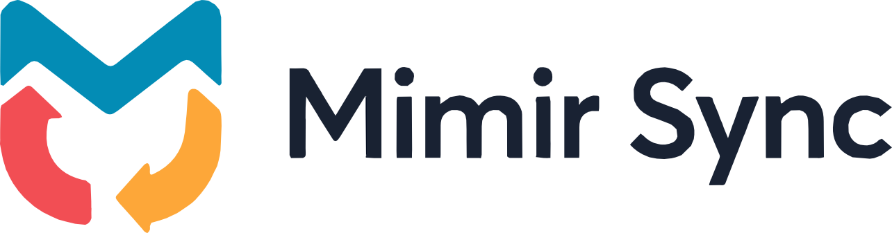

<div align="center">
  
  
  # Mimir Sync
</div>

A Helm chart for syncing Alertmanager configurations and Prometheus rules to a Mimir instance using Kubernetes Jobs.

## Quick Start

### Installation from Helm Repository

Add the repository and install the chart:

```bash
# Add the Helm repository
helm repo add mimir-sync https://antnsn.github.io/mimir-sync
helm repo update

# Install the chart
helm install mimir-sync mimir-sync/mimir-sync -n mimir-sync --create-namespace \
  --set mimir.address=http://mimir-distributed-nginx.mimir.svc.cluster.local:80 \
  --set mimir.tenantId=anonymous
```

### Installation from Local Chart

For local development or testing, you can install directly from the chart directory:

```bash
helm install mimir-sync ./chart -n mimir-sync --create-namespace \
  --set mimir.address=http://mimir-distributed-nginx.mimir.svc.cluster.local:80 \
  --set mimir.tenantId=anonymous
```

### Artifact Hub

This chart is also available on [](https://artifacthub.io/packages/helm/mimir-sync/mimir-sync)

## Releasing a New Version

Releases are driven by a single path: a version bump on `main`. The
[`chart-releaser-action`](.github/workflows/release.yaml) workflow detects the
new `version:` in `chart/Chart.yaml`, then tags `vX.Y.Z`, packages the chart,
publishes it to the `gh-pages` branch and Artifact Hub, and creates the
GitHub Release. **You do not create or push tags yourself.**

### `/codex:review` requirement

Every commit that lands on `main` — including release commits — must have
`/codex:review` run on it first. This is non-negotiable. The release script
prints a reminder before committing, but cannot enforce it.

### Using `scripts/release.sh` (recommended)

```bash
chmod +x scripts/release.sh
./scripts/release.sh --dry-run   # validate in an isolated worktree
./scripts/release.sh
```

The script:

1. Checks preconditions: on `main`, clean working tree, in sync with
   `origin/main`.
2. Prompts for the new version. Validates strictly against
   `^[0-9]+\.[0-9]+\.[0-9]+$` (no pre-release / build metadata).
3. Verifies that `vX.Y.Z` does not already exist locally or on `origin`.
4. Bumps `chart/Chart.yaml` `version` (and optionally `appVersion`).
5. Runs `helm lint`, two `helm template` passes (defaults + all features
   enabled), and `ct lint` if `ct` is on `PATH`.
6. Runs `helm-docs` (pinned to `v1.14.2`, matching CI) to regenerate
   `chart/README.md`.
7. Shows the diff and prints the `/codex:review` reminder.
8. Requires you to type `proceed` (not just `y`) to continue.
9. Commits `chart/Chart.yaml` + `chart/README.md` with the
   `Co-authored-by: Copilot` trailer and pushes to `main`.
10. Prints `gh run watch` so you can follow the release workflow.

`--dry-run` performs the bump, validation, and helm-docs run inside an
isolated `git worktree` rooted at `HEAD`, then tears the worktree down.
Your real working tree is never modified.

#### Prerequisites

- `git`, `helm`, `bash` (script uses `set -euo pipefail`).
- `go` — only required if `helm-docs` is missing; the script will then
  install `github.com/norwoodj/helm-docs/cmd/helm-docs@v1.14.2` (the same
  version used by CI).
- Optional: `ct` for the chart-testing lint pass.

### Manual flow

If you cannot run the script:

1. From a clean `main`, edit `chart/Chart.yaml`:
   ```yaml
   version: X.Y.Z
   appVersion: "X.Y.Z"  # only if the underlying mal-sync image contract changed
   ```
2. Validate:
   ```bash
   helm lint chart/
   helm template release-check chart/ --debug >/dev/null
   helm-docs   # pinned: go install github.com/norwoodj/helm-docs/cmd/helm-docs@v1.14.2
   ```
3. Run `/codex:review` on the staged change.
4. Commit and push to `main`:
   ```bash
   git add chart/Chart.yaml chart/README.md
   git commit -m "chore: prepare for vX.Y.Z release" \
     -m "Co-authored-by: Copilot <223556219+Copilot@users.noreply.github.com>"
   git push origin main
   ```

The `release.yaml` workflow handles tagging, packaging, gh-pages publication,
and the GitHub Release. Watch with `gh run watch` or
`gh run list --workflow=release.yaml -L 1`.

## Configuration

Key configurations in `values.yaml`:

```yaml
mimir:
  address: http://mimir-distributed-nginx.mimir.svc.cluster.local:80
  tenantId: anonymous
  # user: ""
  # password: ""

image:
  repository: ghcr.io/antnsn/mal-sync
  tag: ""  # Falls back to .Chart.AppVersion when empty
  pullPolicy: IfNotPresent

alertmanager:
  enabled: true
  config:
    type: configmap # or 'secret'
    existingName: "" # name of existing ConfigMap/Secret
    key: config.yml

rules:
  enabled: true
  config:
    type: configmap # or 'secret'
    existingName: "" # name of existing ConfigMap/Secret
    key: rules.yml
```

## How It Works

1. The chart creates Kubernetes Jobs that run to sync configurations to Mimir
2. Jobs are triggered when ConfigMaps/Secrets change (requires Reloader)
3. Jobs use `mal-sync` (a wrapper around `mimirtool`/`lokitool`) to sync configurations
4. Completed jobs are automatically cleaned up

## License

GNU General Public License v3.0
