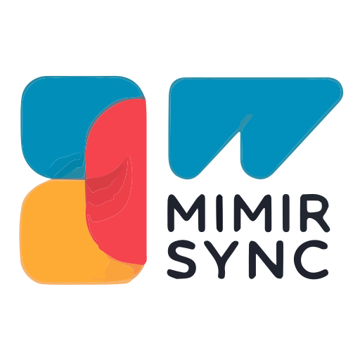

<div align="center">
  
  
  # Mimir Sync
</div>

A Helm chart for syncing Alertmanager configurations and Prometheus rules to a Mimir instance using Kubernetes Jobs.

## Quick Start

### Installation from Helm Repository

Add the repository and install the chart:

```bash
# Add the Helm repository
helm repo add mimir-sync https://antnsn.github.io/mimir-sync
helm repo update

# Install the chart
helm install mimir-sync mimir-sync/mimir-sync -n mimir-sync --create-namespace \
  --set mimir.address=http://mimir-distributed-nginx.mimir.svc.cluster.local:80 \
  --set mimir.tenantId=anonymous
```

### Installation from Local Chart

For local development or testing, you can install directly from the chart directory:

```bash
helm install mimir-sync ./chart -n mimir-sync --create-namespace \
  --set mimir.address=http://mimir-distributed-nginx.mimir.svc.cluster.local:80 \
  --set mimir.tenantId=anonymous
```

### Artifact Hub

This chart is also available on [](https://artifacthub.io/packages/helm/mimir-sync/mimir-sync)

## Releasing a New Version

### Using the Release Script (Recommended)

We provide a release script that automates the entire release process. The script performs the following steps:

1. Validates the new version number
2. Updates the chart version (and optionally appVersion)
3. Runs Helm lint to validate the chart
4. Updates the documentation
5. Shows a diff of changes
6. Asks for confirmation before proceeding
7. Commits the changes, creates a tag, and pushes everything

#### Basic Usage

```bash
# Make the script executable if it's not already
chmod +x scripts/release.sh

# Run the release script
./scripts/release.sh
```

#### Dry Run Mode

To see what the script would do without making any changes:

```bash
./scripts/release.sh --dry-run
```

This will:
- Show what would be committed
- Display the tag that would be created
- Indicate that changes would be pushed
- Exit without making any actual changes

#### Prerequisites

The script requires:
- `git` - For version control operations
- `helm` - For linting the chart
- `go` - For installing `helm-docs` if not already installed
- `helm-docs` - For generating documentation (will be installed automatically if needed)

#### Example Output

```
$ ./scripts/release.sh --dry-run
Current version: 1.0.0
Enter new version (current: 1.0.0): 1.0.1
Update appVersion? (current: 1.0.0) [y/N] n
Running Helm lint...
✓ Helm lint passed
Updating documentation...
No documentation changes detected.

Changes to be committed:
...

The following actions will be performed:
1. Commit version 1.0.1 changes
2. Create and push tag v1.0.1
3. Push changes to main branch

Proceed with release? [y/N] y
[DRY RUN] Would commit changes with message: chore: prepare for v1.0.1 release
[DRY RUN] Would create and push tag: v1.0.1
[DRY RUN] Would push changes to remote
✓ Dry run complete. No changes were made.
```

### Manual Release Process

If you prefer to do it manually:

1. **Update the chart version** in `chart/Chart.yaml` following [semantic versioning](https://semver.org/):
   ```yaml
   version: 1.0.0  # Update this version
   appVersion: "1.0.0"  # Update if the app version changes
   ```

2. **Commit and push** the changes to the `main` branch:
   ```bash
   git add chart/Chart.yaml
   git commit -m "chore: prepare for vX.Y.Z release"
   git push origin main
   ```

3. **Create and push a new tag** which will trigger the release workflow:
   ```bash
   git tag -a vX.Y.Z -m "Release vX.Y.Z"
   git push origin vX.Y.Z
   ```

The GitHub Actions workflow will automatically:
- Package the chart
- Update the Helm repository index
- Publish the new version to the GitHub Pages site

## Configuration

Key configurations in `values.yaml`:

```yaml
mimir:
  address: http://mimir-distributed-nginx.mimir.svc.cluster.local:80
  tenantId: anonymous
  # user: ""
  # password: ""

image:
  repository: grafana/mimirtool
  tag: latest
  pullPolicy: IfNotPresent

alertmanager:
  enabled: true
  config:
    type: configmap # or 'secret'
    existingName: "" # name of existing ConfigMap/Secret
    key: config.yml

rules:
  enabled: true
  config:
    type: configmap # or 'secret'
    existingName: "" # name of existing ConfigMap/Secret
    key: rules.yml
```

## How It Works

1. The chart creates Kubernetes Jobs that run to sync configurations to Mimir
2. Jobs are triggered when ConfigMaps/Secrets change (requires Reloader)
3. Jobs use `grafana/mimirtool` to sync configurations
4. Completed jobs are automatically cleaned up

## Maintenance

### Updating the Helm Chart

When you make changes to the chart, follow these steps to update the Helm repository:

1. Update the version in `chart/Chart.yaml`
2. Package the chart and update the repository index:

```bash
# Package the chart
helm package chart/ -d /tmp/helm-repo

# Update the repository index
cd /tmp/helm-repo
helm repo index . --url https://antnsn.github.io/mimir-sync

# Commit and push changes
git add .
git commit -m "Update chart to version X.Y.Z"
git push
```

## License

GNU General Public License v3.0
